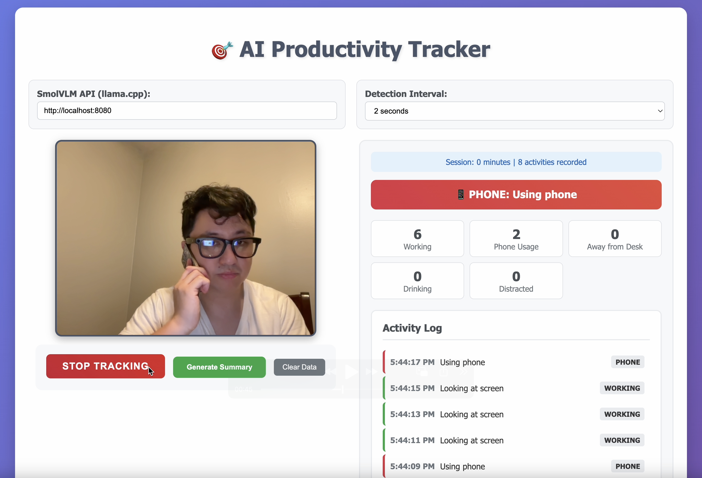

# 🎯 AI Productivity Tracker



An AI-powered productivity tracker that uses your webcam to monitor work habits and provide intelligent insights. Built with SmolVLM for real-time activity detection and local analytics for comprehensive productivity analysis.

> **🙏 Credits**: This project is based on the excellent [SmolVLM real-time webcam demo](https://github.com/ngxson/smolvlm-realtime-webcam) by [@ngxson](https://github.com/ngxson). The original demo has been transformed into a comprehensive productivity tracking application with enhanced UI, activity categorization, and local analytics.

## ✨ Features

- **🔍 Real-time Activity Detection**: Monitors 5 distinct activity types with laptop-optimized detection
- **💻 Laptop-Optimized**: Specifically designed for laptop webcam positioning and work scenarios
- **📊 Activity Logging**: Timestamped activity log with browser cache persistence
- **📈 Local Analytics**: Comprehensive productivity insights generated locally
- **🔒 Privacy-First**: All processing happens locally on your machine
- **⚡ No External Dependencies**: Works completely offline after setup

## 📋 Activity Categories

The tracker monitors these 5 distinct productivity categories:

- **💻 Working**: Looking at screen, focused on computer, hands on keyboard, typing
- **📱 Phone Usage**: Using visible mobile phone or smartphone (device must be visible)
- **🚶 Away**: Not visible in camera frame, physically absent from workspace
- **☕ Drinking**: Taking drink breaks (coffee, water, etc.)
- **😴 Distracted**: Present but not focused - looking away, talking, yawning, stretching, fidgeting

## 🚀 Installation & Setup

### For macOS (Recommended)

#### 1. Install llama.cpp via Homebrew
```bash
brew install llama.cpp
```

#### 2. Start the SmolVLM Server
```bash
llama-server -hf ggml-org/SmolVLM-500M-Instruct-GGUF
```

*Note: Add `-ngl 99` if you have a compatible GPU for faster processing:*
```bash
llama-server -hf ggml-org/SmolVLM-500M-Instruct-GGUF -ngl 99
```

#### 3. Run the Application
1. Open `index.html` in your web browser
2. Grant camera permissions when prompted
3. Click "Start Tracking" to begin monitoring
4. Use "Generate Summary" for detailed productivity insights

### Alternative Installation (Manual)

If you prefer to build from source:

```bash
# Clone and build llama.cpp
git clone https://github.com/ggml-org/llama.cpp
cd llama.cpp && make

# Start the server
./llama-server -hf ggml-org/SmolVLM-500M-Instruct-GGUF -ngl 99
```

## 🎮 How to Use

### Starting a Session
1. **Launch Server**: Run the llama-server command in Terminal
2. **Open App**: Open `index.html` in your browser
3. **Grant Permissions**: Allow camera access when prompted
4. **Configure Settings**: Adjust detection interval if needed (default: 2 seconds)
5. **Start Tracking**: Click "Start Tracking" to begin monitoring

### During a Session
- **Real-time Feedback**: See current activity and live statistics
- **Activity Log**: View timestamped list of all detected activities
- **Session Info**: Track session duration and total activities

### Generating Insights
- **Local Summary**: Click "Generate Summary" for comprehensive productivity analysis
- **Detailed Metrics**: View activity breakdowns, percentages, and recommendations
- **Pattern Recognition**: Identify productivity patterns and distraction sources

## 📊 Sample Summary Output

```
📊 PRODUCTIVITY SUMMARY
Session Duration: 45 minutes
Total Activities: 127

📈 ACTIVITY BREAKDOWN:
• Working: 89 times (70%)
• Phone Usage: 8 times (6%)
• Away from Desk: 12 times (9%)
• Drinking Breaks: 6 times (5%)
• Distracted: 12 times (9%)

🎯 PRODUCTIVITY ASSESSMENT: Good

🔍 KEY INSIGHTS:
✅ Good focus levels maintained
✅ Minimal phone distractions
✅ Good desk presence

💡 RECOMMENDATIONS:
• Great job! Keep up the focused work

📱 DISTRACTION ANALYSIS:
Main Issue: None
Focus vs Distraction Ratio: 70% focused, 30% other activities
```

## ⚙️ Configuration Options

### Detection Interval
- **1 second**: High frequency monitoring (more data, higher CPU usage)
- **2 seconds**: Balanced monitoring (recommended)
- **3-5 seconds**: Lower frequency monitoring (less CPU usage)

### SmolVLM API
- Default: `http://localhost:8080`
- Ensure llama-server is running on this port

## 🔧 Troubleshooting

### Camera Issues
- **Permission Denied**: Grant camera permissions in browser settings
- **Camera in Use**: Close other applications using the camera
- **HTTPS Required**: Use `localhost` or serve over HTTPS

### Server Issues
- **Connection Failed**: Ensure llama-server is running
- **Port Conflicts**: Check if port 8080 is available
- **Model Loading**: Wait for SmolVLM model to fully load

### Performance Issues
- **High CPU Usage**: Increase detection interval
- **Slow Detection**: Add `-ngl 99` flag for GPU acceleration
- **Memory Issues**: Restart browser to clear cache

## 🎯 Detection Accuracy

### What Works Best
- **Good Lighting**: Ensure adequate lighting for accurate detection
- **Clear View**: Position camera to show face and upper body
- **Stable Position**: Avoid excessive camera movement
- **Normal Distance**: Sit at normal working distance from camera

### Detection Specifics
- **Phone Detection**: Requires visible phone device (no assumptions from posture)
- **Away Detection**: Only when completely not visible in frame
- **Distracted Detection**: Focuses on eye direction and attention indicators
- **Working Detection**: Looking at screen/camera area with engaged posture

## 📱 Privacy & Data

- **Local Processing**: All AI processing happens on your machine
- **No External Calls**: No data sent to external servers
- **Browser Storage**: Activity data stored locally in browser cache
- **No Recording**: No video/images are saved or transmitted
- **Clear Data**: Use "Clear Data" button to remove all stored information

## 🛠️ Technical Details

- **AI Model**: SmolVLM 500M (via llama.cpp)
- **Frontend**: Vanilla HTML/CSS/JavaScript
- **Storage**: Browser localStorage
- **Camera**: WebRTC getUserMedia API
- **Processing**: Real-time image analysis with configurable intervals

## 📈 Use Cases

- **Remote Work Monitoring**: Track focus during work-from-home sessions
- **Study Sessions**: Monitor concentration during study periods
- **Productivity Analysis**: Identify patterns and improvement opportunities
- **Break Tracking**: Ensure healthy break patterns
- **Distraction Identification**: Understand what breaks your focus

## 🤝 Contributing

This is a self-contained productivity tool. To modify:

1. **Activity Detection**: Update the `PRODUCTIVITY_PROMPT` in `index.html`
2. **UI Changes**: Modify the HTML/CSS sections
3. **Analytics**: Enhance the `generateLocalSummary()` function
4. **New Categories**: Add new activity types and update the statistics display

## 📄 License

MIT License - Feel free to use and modify for your productivity needs!

---

**Happy Productivity Tracking! 🚀**
